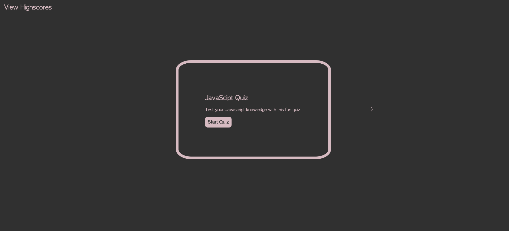

# JavaScript Quiz

## Test your JavaScript skills with this fun test!

- I was motivated to create this project to test my peers skills on JavaScript fundamentals!

- I personally built this project to test my skills in HTML, CSS, And JavaScript with all of the
- new concepts I have learned so far in my bootcamp. This project really pushed me to share what I
- have learned and how to access information I need answers to.

- This JavaScript quiz answers some fundamental questions you should have answers to in the beginning
- of learning JavaScript.

- During the creation of this project I was pushed to apply the knowledge I acquired in our JavaScript
- module and to find good information online for concepts I was struggling with.

## Usage

- You can access the JavaScript quiz at this link 

- Screenshot of the deployed applcation 